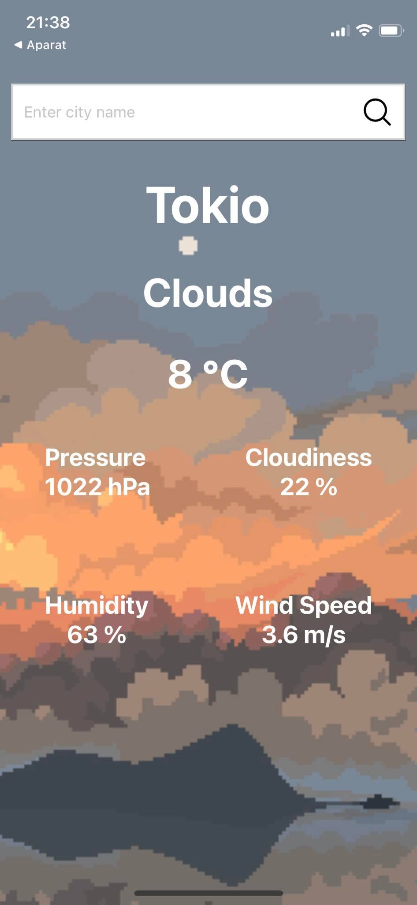

# **OPENWEATHERMAP APP**
--------------------------

## **The following project was made for academic purposes only.**

The application is based on React Native with the help of Expo.

## **THE UI**

## **TECHNOLOGIS AND FRAMEWORK USED**
More about the technologies used below:
* [React Native](https://reactnative.dev)
* [Expo CLI](https://expo.dev)
* [Node.js (v. 16.18.1)](https://nodejs.org/en/)

## **API USED**
The API used was OpenWeather API <- linkowanie based on a free plan containing current weather data.

## **HOW TO RUN THE APP**
**Step 1:**
* Install all required technologies on your PC.
* Install the Expo app on your mobile device to view the live output.
* Copy the repo and open it in choosen editor (e.g. VS Code).

**Step 2:**
* Go to https://openweathermap.org/ to get an API key (registration required).
* Paste your key in the 7th line of App.js: 
*`const API_KEY = "YourAPIKey";`*

**Step 3:**
* Type in new terminal `npm start`.

**Step 4:**
* Scan the generated code with the camera on your mobile device - the Expo app should launch automatically and display the weather for the default city - Sopot.

## SOURCE OF THE GRAPHICS
- [Clouds](https://twitter.com/16pxl/status/979134925541707778/photo/1)
- [Haze](https://www.peakpx.com/en/hd-wallpaper-desktop-vswzr)
- [Thunder](https://www.behance.net/gallery/151197543/Animated-StormThunder-Pixel-Art)
- [Rain](https://www.reddit.com/r/PixelArt/comments/5ter0b/oc_storm_pixel_dailies/)
- [Snow](https://www.reddit.com/r/PixelArt/comments/egtdr7/winter_rest_pixel_art_i_did_for_my_gf/)
- [Sunny](https://8pxl.tumblr.com/post/168550424595/favorite-art-i-made-in-2017-this-year-has-been)